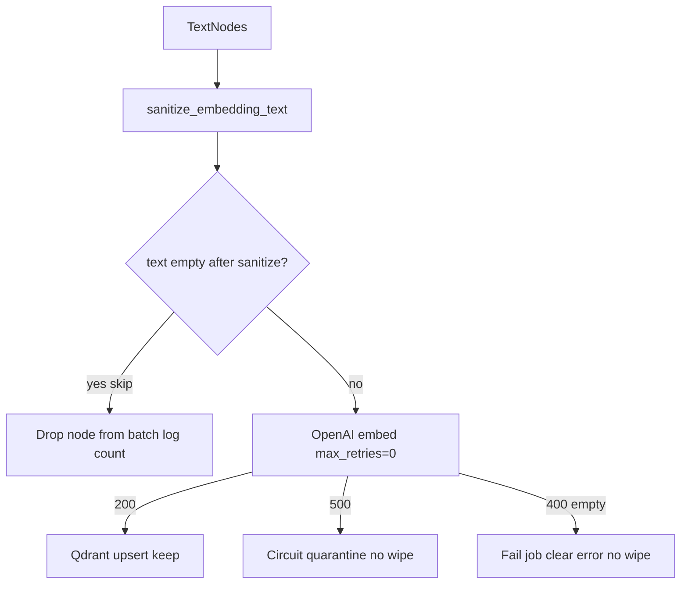

# Plan: Empty embed input + fail-path wipe

## Failure analysis (4 jobs)

| runId | Outcome | Cause | Qdrant residue |
|-------|---------|-------|----------------|
| `b3e3bc6f-…` | failed | OpenAI **400**: `input[31]` empty string | **0** (wiped by `_safe_cleanup`) |
| `a8ee85a3-…` | was cancel; **now running** attempt 3 | Deploy recreate cancel | **~5.2k** points (rebuilding) |
| `9b2c8acf-…` | failed | Cancelled in flight (~8s) during recreate | **0** |
| `2cc3492c-…` | failed | Cancelled in flight during recreate | **0** |

Only **`b3e3bc6f`** is a content/pipeline bug. The other three are restart casualties from the hot-patch; one already self-healed via scheduler.

Current sanitize + circuit breaker **do not** cover empty strings (400 ≠ 500).

## Implementation (concrete)

### 1. Clean: drop empty embed texts
In [`embedding_sanitize.py`](src/geek_crawler_rag/embedding_sanitize.py) / [`llama_engine.embed_and_upsert`](src/geek_crawler_rag/llama_engine.py):
- After sanitize, **skip nodes whose text is empty or whitespace-only**
- Log `skipped_empty_embed_texts=N`
- If an entire pending batch becomes empty, skip upsert (return 0) instead of calling OpenAI
- Optionally skip empty `embed_text` in [`llama_nodes.py`](src/geek_crawler_rag/llama_nodes.py) when building parent/child nodes

### 2. Catch: client validation errors without wipe
In [`indexer.py`](src/geek_crawler_rag/indexer.py):
- Treat `openai.BadRequestError` (and empty-input message) like circuit-open for **cleanup policy**: mark failed, **skip `_safe_cleanup`**
- Put a clear `status.error` (e.g. `OpenAI 400 empty embedding input; points preserved`) — not only the sanitized generic string
- Do **not** open circuit/quarantine for 400s unless we want a quarantine dump for debugging (optional light quarantine of the bad batch)

### 3. Tests
- Sanitize/embed: all-control string → skipped, not sent
- Batch with one empty + valid texts → only valids embedded
- Indexer: mocked `BadRequestError` empty input → failed, `delete_by_run_id` not called after start

### 4. Ops follow-up
- Hot-patch Hostinger after merge
- Requeue `b3e3bc6f-…` (and confirm `9b2c8acf` / `2cc3492c` get scheduled)
- Leave cancel-only failures to scheduler; no quarantine expected

## Out of scope
- Local embedding fallback
- Treating all 4xx as no-wipe (only empty-input / clearly non-retryable client errors we identify)
- Changing Qdrant on_disk further
