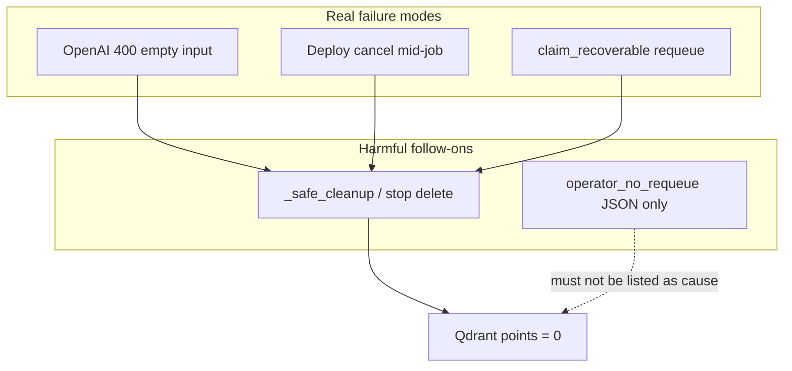

# Plan: Quarantine cohort — real causes & recovery

**Correction:** `reason: operator_no_requeue` on the five JSON files is an **operator stamp** from stopping auto-requeue. It is **not** the failure cause. Treat those files as incomplete metadata; use API logs + job progress as source of truth.

## Actual causes (runtime evidence)

| runId (short) | Real cause | Log / evidence | Qdrant now |
|---------------|------------|----------------|------------|
| `b3e3bc6f` | OpenAI **400** empty embed input | `Invalid 'input[31]': input cannot be an empty string.` then `_safe_cleanup` deleted points | **0** |
| `a8ee85a3` | **Cancelled in flight** (deploy/API recreate) + later scheduler re-claim attempt 3 | `Indexer cancelled while job was in flight`; later `Skipping Qdrant delete … attempt=3`; stop path still deleted points | **0** |
| `2cc3492c` | **Cancelled in flight** during recreate | Snapshot error: cancelled; mid-run (366/1751, 4006 chunks) | **0** |
| `9b2c8acf` | **Cancelled in flight** during recreate | Snapshot error: cancelled; barely started (3/1347) | **0** |
| `35f41ddc` | **Auto `claim_recoverable`** after API restart mid-index | Started `trigger=recovery`; then operator stop → delete | **0** |

Shared outcome that matters: **all five runs have 0 Qdrant points** despite non-zero `chunksUpserted` in snapshots — wipe/cancel paths destroyed residue.

## Why the prior “finding” was wrong

- Quarantine volume contains only `requeue_quarantine_*.json` stubs we wrote.
- Real circuit quarantine (`failed_embedding_*.json` with batch `items`) was **never written** for the 400 — circuit only opens on HTTP **500**.
- Stamping `operator_no_requeue` overwrote the narrative; plan must lead with **400 / cancel / recovery**, not the stamp.

## Goals (revised)

1. Fix **empty embed → 400** and **no wipe** on that path (and on cancel/fail where points were already upserted).
2. Persist **no auto-requeue / no claim_recoverable**.
3. On fail-closed (400 or 500), write a **real** quarantine dump (`items` + statusCode + runId) — same shape as circuit files — not an operator stub.
4. Deliberately re-index the five runs (all need full rebuild; residue is gone).

---

## Phase A — Harden (required before requeue)

### A1. Empty embed input
- Drop empty/whitespace texts after sanitize; never send to OpenAI.
- Catch `BadRequestError` empty-input: fail job, **skip wipe**, write `failed_embedding_*.json` with batch preview (`statusCode: 400`).

### A2. No wipe on non-success abort
- Circuit 500: already no wipe.
- Extend: empty-input 400 and clean cancel/stop must not delete points for a run that already upserted (or always skip wipe when `chunksUpserted > 0` / attempt policy clarified).
- Evidence: `b3e3` wiped after 400; `a8ee`/`35f41` deleted on stop despite progress.

### A3. No automatic requeue
- Commit: no `claim_recoverable` on start; no `nextRetryAtUtc` on FAILED; FAILED/SKIPPED always excluded.

### A4. Quarantine honesty
- Operator “park job” may set Mongo `skipped`, but must **preserve** prior `error` (or write `priorError`) and optionally attach log excerpt.
- Do not invent `reason: operator_no_requeue` as the causal field; use `action: park_no_requeue` + `cause` from last real error.

---

## Phase B — Requeue order (all are full rebuilds)

| Order | runId | Why |
|-------|-------|-----|
| 1 | `b3e3bc6f` | Prove A1 (400 empty) is fixed |
| 2 | `9b2c8acf` | Smallest progress / complete crawl |
| 3 | `2cc3492c` | Complete crawl |
| 4 | `a8ee85a3` | External, was farthest along |
| 5 | `35f41ddc` | External, recovery artifact |

Manual `POST /v1/index` only; one at a time.

---

## Phase C — Docs

- Circuit recovery doc: 400 empty gets same quarantine *shape* as 500; operator park ≠ cause.
- Replace/rewrite any plan text that listed “operator requeue stops” as the cohort cause.

## Acceptance

- [ ] Reproducing empty input does **not** call OpenAI with `""`; job fails closed with real quarantine JSON if a 400 still occurs
- [ ] Failed/cancelled jobs with upserts do **not** zero Qdrant for that runId
- [ ] No `claim_recoverable` / failed auto-retry after deploy
- [ ] Five runs re-indexed to `complete` with non-zero points
- [ ] Quarantine dir causal fields never claim operator park as the root cause
