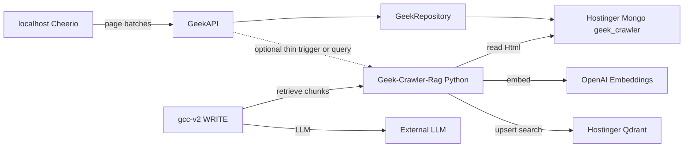

# Geek-Crawler-Rag — Architecture

**Correctness over expediency.**

Product plan: [`plans/geek-crawler-rag.md`](./plans/geek-crawler-rag.md)  
Rules: [`plans/rules.md`](./plans/rules.md)

This document is the **topology and dependency map** for Geek-Crawler-Rag: where each layer lives, what calls what, and hard boundaries with Geek-Crawler, GeekBackend, and content-creator-v2.

---

## 1. This application

| Item | Value |
|------|-------|
| Repo | `/Users/jeffmartin/development/Geek-Crawler-Rag` |
| Role | Index Geek-Crawler Mongo HTML into Qdrant; serve retrieval (RAG) for consumers |
| Runtime | **Python** worker/API — AI ecosystem fit for chunk / embed / vector search |
| Vector DB | **Qdrant** on same Hostinger host as Mongo |
| Corpus | Mongo DB `geek_crawler` (HTML owned by GeekRepository writes; RAG **reads** only) |
| Host | Hostinger KVM 2 — 2 CPU / 8 GB RAM / 100 GB disk / 8 TB bandwidth |

Geek-Crawler-Rag is **not** Content Creator v2. It is **not** GeekAPI. It is **not** a second crawler. It does **not** fetch partner/competitor URLs.

---

## 2. Platform stack

| Layer | System | Responsibility |
|-------|--------|----------------|
| **Crawl** | Cheerio (localhost) → GeekAPI → GeekRepository | Write pages into Mongo |
| **Corpus** | Mongo `geek_crawler` on Hostinger | Source of truth for HTML |
| **Index + query** | **Geek-Crawler-Rag** (this repo) | Chunk, English-only embed, Qdrant upsert/search |
| **Vectors** | Qdrant (colocated) | Rebuildable index per `runId` |
| **Consumer** | content-creator-v2 / GeekAPI WRITE | Query Geek-Crawler-Rag; inject chunks into prompts |

Dashed GeekAPI→Geek-Crawler-Rag edge: optional glue only. RAG does **not** live inside GeekAPI.

---

## 3. Hard rules

1. **This repo owns RAG** — Python + Qdrant ops and index/query API. Not buried under `ContentCreatorV2/*` or phi `src/`.
2. **Mongo is read-only for Geek-Crawler-Rag** — never a second write path for crawl HTML.
3. **No crawl in Geek-Crawler-Rag** — no Cheerio/Playwright fetch of partner or competitor sites.
4. **Full index per `runId`** — all usable English pages in that run (~12k typical); rebuild = delete-by-`runId` then reindex.
5. **`crawlType` is a filter** — `partner` and `competitors` share one pipeline.
6. **English only** at embed/upsert — skip non-`en`. Spanish site not in scope.
7. **Qdrant is rebuildable** — Mongo remains durable; index can be wiped and rebuilt.
8. **Fail soft for consumers** — index/query miss → notify-and-skip research; do not block generate.
9. **Hostinger caps** — Qdrant ~3 GB RAM, search threads = 1; indexer concurrency = 1; leave OS headroom.

---

## 4. Hostinger process layout

| Process | Role | Cap |
|---------|------|-----|
| Mongo | `geek_crawler` HTML | Existing |
| Qdrant | Vectors + payload | ~3 GB RAM, `MAX_SEARCH_THREADS=1` |
| Geek-Crawler-Rag Python | Index + query HTTP | ~2 GB RAM, index concurrency = 1 |

No Playwright required on this box for RAG.

---

## 5. Related repos

| Repo | Path | Relation |
|------|------|----------|
| Geek-Crawler | `/Users/jeffmartin/development/Geek-Crawler` | Crawl UI / product; corpus producer (via API) |
| GeekBackend | `/Users/jeffmartin/development/GeekBackend` | GeekAPI ingest + GeekRepository Mongo writes |
| content-creator-v2 | `/Users/jeffmartin/development/content-creator-v2` | **Consumer** of Geek-Crawler-Rag query API only |

---

## 6. Contracts (summary)

**Index:** `POST` index for `runId` (idempotent). Terminal crawl statuses `complete` / `external` (or explicit admin).

**Query:** embed need + filter `runId` (+ `host`, `crawlType`); return top-k chunks with `url` / text for grounding.

**Payload fields:** `runId`, `crawlType`, `host`, `url`, `finalUrl`, `chunkIndex`, `language` (`en`), `title`.

Collection name: `geek_crawler_chunks`.

Embeddings: OpenAI `text-embedding-3-small`.

Full detail: [`plans/geek-crawler-rag.md`](./plans/geek-crawler-rag.md).
