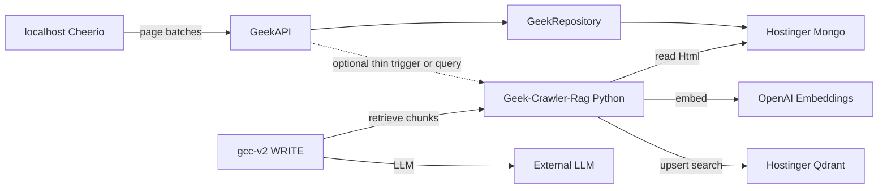

# Geek-Crawler-Rag — Plan

**Correctness over expediency.**

Architecture: [`../architecture.md`](../architecture.md)  
Rules: [`rules.md`](./rules.md)

Standalone retrieval product for the **Geek-Crawler** Mongo corpus. Content Creator v2 and GeekAPI **consume** this service; they do not own it.

---

## Scope

| In | Out |
|----|-----|
| Python index + query API | Crawl / Cheerio / Playwright fetch |
| Qdrant on Hostinger next to Mongo | .NET RagWorker |
| Full English index per `runId` | Dual-language / Spanish indexing |
| `partner` **and** `competitors` runs | JSON-LD / advert-pack as architecture center |
| Rebuildable vectors | Cloud vector DB / pgvector |
| Thin optional trigger from GeekAPI | RAG logic inside content-creator-v2 `src/` |

---

## Locked decisions

| Decision | Lock |
|----------|------|
| Stance | **Correctness over expediency** — Python for RAG (AI ecosystem), not .NET monolingual convenience |
| Ownership | **This repo (Geek-Crawler-Rag)** — sibling to Geek-Crawler; not phi, not GeekAPI |
| RAG system | **Python + Qdrant + Mongo** on Hostinger KVM 2 (2 CPU / 8 GB / 100 GB) |
| Content Creator v2 | **Consumer only** — query API; no indexer/Qdrant/embed in phi |
| GeekAPI | **Not the RAG stack** — at most thin trigger/query proxy; crawl write path unchanged |
| Crawl | Cheerio on **localhost** → GeekAPI → GeekRepository → Mongo; gcc-v2 never crawls tools/competitors |
| Indexed runs | **Every completed Geek-Crawler run** — `crawlType` is label/filter only |
| Index scope | **Full RAG per `runId`** (~12k pages typical) |
| Language | **English only** at embed/upsert |
| Embeddings | OpenAI `text-embedding-3-small` |
| Source of truth | Mongo HTML; Qdrant rebuildable |
| Failure | Index/query miss → notify-and-skip; do not block generate |
| Ship consumers | Partner/tools **and** competitor retrieval in gcc-v2 WRITE (different prompt policy) |

---

## Topology

---

## Index pipeline (per `runId`)

1. Trigger on terminal run status (`complete` / `external`) or explicit admin `POST`.
2. Paginate Mongo pages for that `runId`; log **Mongo page count**.
3. Extract text; detect language; **skip non-English**.
4. Chunk (~500–800 tokens, small overlap).
5. Embed + upsert to collection `geek_crawler_chunks`.
6. Payload: `runId`, `crawlType`, `host`, `url`, `finalUrl`, `chunkIndex`, `language` (`en`), `title`.
7. Reindex: delete points with that `runId`, then full pass.
8. Index concurrency = **1**.

---

## Query pipeline (gcc-v2 WRITE)

1. Resolve latest run for seeds + `crawlType` (`partner` or `competitors`).
2. Query Geek-Crawler-Rag: embed need + filter `runId` (+ `host` when focusing one site); language `en` implicit.
3. Top-k chunks → bounded prompt context.
4. Same retrieval for partner and competitors; WRITE instructions differ (tools vs differentiate-only / no rival CTAs).

---

## Hostinger layout

| Process | Cap |
|---------|-----|
| Mongo | Existing |
| Qdrant | ~3 GB RAM, `MAX_SEARCH_THREADS=1` |
| Geek-Crawler-Rag Python | ~2 GB RAM, index concurrency = 1 |

---

## Implementation checklist

- [x] Compose: Qdrant + Geek-Crawler-Rag API on Hostinger
- [x] Read Mongo `crawl_pages` by `runId` (batched Html)
- [x] Language detect → English-only embed
- [x] Index + delete-by-`runId` + status reporting
- [x] Query API with filters (`runId`, `crawlType`, `host`)
- [x] Optional: GeekAPI thin trigger on run complete
- [x] gcc-v2 WRITE: partner + competitor chunk injection
- [ ] Verify on a real ~12k-page run; confirm page count logged

---

## Effort

~**2–3 weeks** focused for typical ~12k-page full-run English index + partner and competitor WRITE retrieval + Hostinger compose/ops.

---

## Related docs (consumers)

| Doc | Location |
|-----|----------|
| Crawl architecture | `/Users/jeffmartin/development/content-creator-v2/plan/crawl-architecture.md` |
| Geek-Crawler ↔ gcc-v2 | `/Users/jeffmartin/development/content-creator-v2/plan/geek-crawler.md` |
| Geek-Crawler product | `/Users/jeffmartin/development/Geek-Crawler/plans/geek-crawler.md` |
